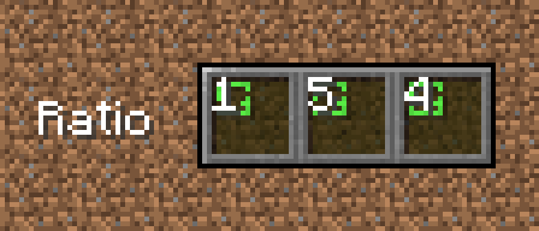

# BlockMixer • Fabric Mod

**Description**  
This mod is designed to ease the building process.

*Without BlockMixer / With BlockMixer*  
 

**How it works**  
After you put the block, the mod chooses a random slot from BlockMixer's binded slots and automatically switches your character's selection to it.

**Requirements**
- `Required` [Fabric](https://fabricmc.net/use/installer/)
- `Required` [Fabric API](https://www.curseforge.com/minecraft/mc-mods/fabric-api/files)
- `Optional` [Cloth Config API](https://www.curseforge.com/minecraft/mc-mods/cloth-config/files)
- `Optional` [Mod Menu](https://www.curseforge.com/minecraft/mc-mods/modmenu/files)

## Features
- Different mixing modes:  
  **Default**: random selection of slots, **Non-repeating**: slot cannot be repeated twice in a row, **Non-repeating [2]**: the slot cannot be repeated three times in a row.
- Ability to adjust slot ratio:  
  The slot ratio setting allows you to select the priority slot that BlockMixer will select. Thus, by setting the ratio to 10 for one slot and 1 for the other, the first slot will randomize more often at 10.

## How to use

**Basic usage**  
To bind and unbind a slot to BlockMixer click `B`. The binded slot will be highlighted with a green indicator.

**Different mixing modes**  
To select mixing mode go to mod settings (Mod Menu required). 

**"Toggle Mod" option**  
This option is for stopping mod without cleaning BlockMixer's binded slots. To toggle mod press "Sneak" button (`Shift` by default)  + "Toggle hotbar slot" button (`B` by default), `Shift+B`. All binded slots will be highlighted with a red indicator.

  

**"Slot ratio" option**  
To increase slot ratio press `]` (by default). To decrease slot ratio press `[` (by default).

  
