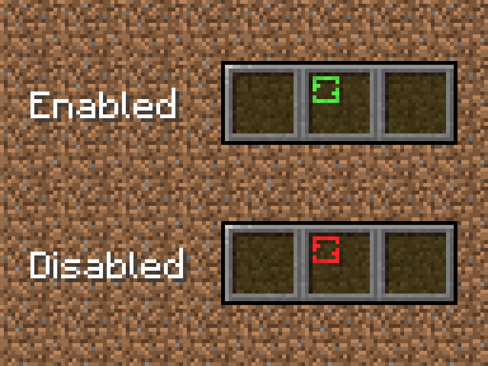

# BlockMixer • Fabric Mod • Progress **~85%**

**Description**  
This mod is designed to ease the building process.

*Without BlockMixer / With BlockMixer*  
 

**How it works**  
After you put the block, the mod chooses a random slot from BlockMixer's binded slots and automatically switches your character's selection to it.

**Requirements**
- [Fabric](https://fabricmc.net/use/installer/) for Minecraft 1.18.X
- [Fabric API](https://www.curseforge.com/minecraft/mc-mods/fabric-api/files) 0.44.0+1.18 +
- [Cloth Config API](https://www.curseforge.com/minecraft/mc-mods/cloth-config/files) v6.1.48 +

## Features
- Different mixing modes:  
  **Default**: random selection of slots, **Non-repeating**: slot cannot be repeated twice in a row, **Non-repeating [2]**: the slot cannot be repeated three times in a row.

## How to use

**Basic usage**  
To bind and to unbind and unbind a slot to BlockMixer click `B`. The binded slot will be highlighted with a green indicator.

**"Toggle Mod" option**  
This option is for disable mod without cleaning BlockMixer's binded slots. To toggle mod press "Sneak" button (`Shift` by default)  + "Toggle hotbar slot" button (`B` by default), `Shift+B`. All binded slot will be highlighted with a green indicator.

